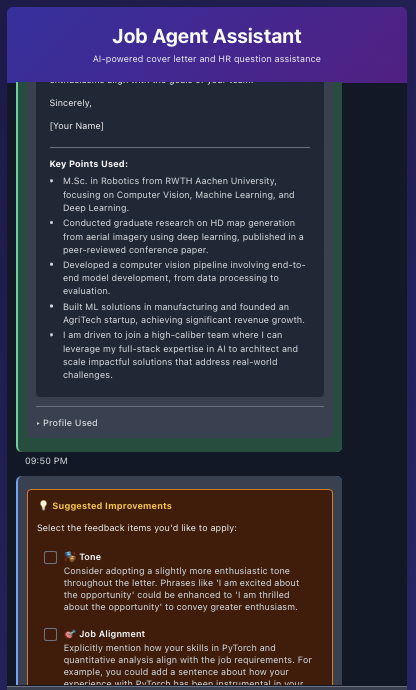
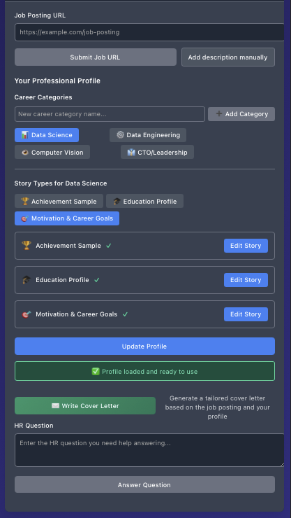

# Job Agent - Multi-Agent Job Application Assistant

[](https://fastapi.tiangolo.com/)
[](https://reactjs.org/)
[](https://www.langchain.com/)
[](https://openrouter.ai/)

An intelligent, multi-agent job application assistant that helps users create tailored cover letters and answer HR questions using AI-powered analysis of job descriptions and user profiles.

## 🤖 What It Does

Job Agent uses a **multi-agent AI system** with 4 specialized agents working together:

1. **Data Collector Agent**: Analyzes job descriptions and intelligently filters relevant user profile data
2. **Writer Agent**: Generates professional cover letters and contextual HR question answers
3. **Feedback Agent**: Reviews generated content and suggests targeted improvements
4. **Modificator Agent**: Applies user-selected feedback to refine and enhance content

The system ensures **zero hallucination** - all content is based solely on the information you provide, with intelligent matching between your experience and job requirements.

## 🎨 Interface Demo

| Main Chat Interface | Profile Setup & Job Processing |
|-------------------|-------------------------------|
|  |  |

## 🎯 Project Status & TODO List

### ✅ **Core Features (Complete)**
- [x] **4 Specialized AI Agents**: Data Collector, Writer, Feedback, and Modificator
- [x] **LangChain Integration**: Full orchestration using chains and prompt templates
- [x] **Hallucination Prevention**: Strict constraints ensure only provided data is used
- [x] **Intelligent Profile Matching**: Job-specific content selection from user profiles
- [x] **Cover Letter Generation**: Professional, tailored cover letters
- [x] **HR Question Answering**: Contextual answers to common interview questions
- [x] **FastAPI Backend**: High-performance async web framework with comprehensive APIs
- [x] **React Frontend**: Modern chat-based interface with TypeScript
- [x] **Session Management**: Persistent chat sessions with message history
- [x] **Profile Storage**: JSON-based profile persistence with CRUD operations
- [x] **Docker Deployment**: Complete containerization with production configs
- [x] **Comprehensive Testing**: Unit, integration, and end-to-end tests

### 🔄 **Infrastructure & Enhancements (In Progress)**
- [x] **Environment Configuration**: API key setup and validation
- [x] **Dependency Management**: uv for Python, npm for Node.js
- [x] **Development Setup**: Local development environment ready
- [ ] **Context Persistence for Modify**: Store/reuse job description and filtered profile so feedback edits stay grounded
- [ ] **Data Collector & Writer Tuning**: Broaden role variant coverage, keep richer job details, and extract key points to drive better drafts
- [ ] **LLM Observability & Tests**: Structured logging around prompt→parser calls plus regression checks to catch fallback/JSON failures
- [ ] **CI/CD Pipeline**: Automated testing and deployment
- [ ] **Monitoring**: Logging, metrics, and error tracking

### 🚀 **Future Enhancements**
- [ ] **Session Persistence (Frontend)**: Chat history survives browser refreshes
- [ ] **Profile Management UI**: Advanced profile editing and templates
- [ ] **Batch Processing**: Generate content for multiple jobs simultaneously
- [ ] **Analytics Dashboard**: Track application success rates
- [ ] **Profile Templates**: Pre-built profiles for common roles
- [ ] **Integration APIs**: Connect with LinkedIn, Indeed, and job platforms
- [ ] **Advanced AI Models**: Support for multiple LLM providers
- [ ] **Multi-language Support**: Internationalization
- [ ] **Mobile App**: Native mobile application
- [ ] **Team Collaboration**: Shared profiles and team features

## 🚀 Quick Start

### Prerequisites
- Python 3.11+
- Node.js 18+
- OpenRouter API key ([get one here](https://openrouter.ai/))

### Local Development
```bash
# Clone repository
git clone <repository-url>
cd job_agent

# Backend setup
cd backend
uv sync  # Install dependencies
cp .env.example .env  # Configure your OpenRouter API key
python main.py  # Start backend on http://localhost:8000

# Frontend setup (new terminal)
cd ../frontend
npm install  # Install dependencies
npm run dev  # Start frontend on http://localhost:5173
```

### Docker Deployment
```bash
# Quick production deployment
cp production.env .env  # Configure your API key
./deploy.sh  # Or: docker-compose up --build -d
# Access at http://localhost
```

📖 **Detailed setup instructions**: See [backend/README.md](backend/README.md) and [frontend/README.md](frontend/README.md)

📖 **Complete usage guide and troubleshooting**: See [frontend/README.md](frontend/README.md) for detailed user interface walkthrough

## 📄 License

This project is open source and available under the MIT License.

## 🤝 Contributing

Contributions are welcome! Please see the component-specific READMEs for development guidelines:

- [Backend Development](backend/README.md#contributing)
- [Frontend Development](frontend/README.md#contributing)

## 📞 Support

For questions or support, please open an issue on the GitHub repository.

---

**Built with ❤️ using LangChain, FastAPI, and React**
